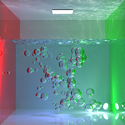
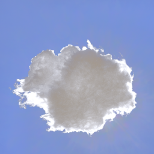
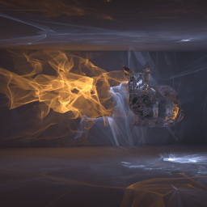
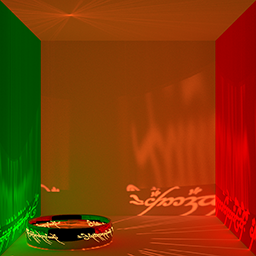
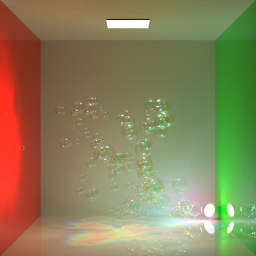
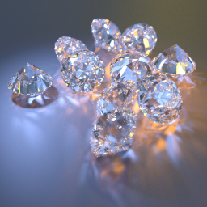
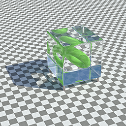

# etx-tracer

Physically-based GPU and CPU ray-tracer emerging on a surface.

#### Features
 * Vertex Connection and Merging algorithm (CPU and GPU);
 * Full-spectral rendering in CPU integrators;
 * Heterogeneous and scattering medium rendering in path tracing integrators (CPU and GPU);
 * Volumetric Bidirectional Path Tracing integrator;
 * Variety of BSDFs: 
    - basic materials - diffuse, plastic, conductor, dielectric;
    - additionaal materials - thinfilm, translucent, coating, mirror, coating;
    - generic PBR material (WIP);
 * Variety of emitters: 
    - area;
    - environment map;
    - directional emitter with finite angluar size;
    - collimated area lights (lasers);
 * Spectral representation of material's properties (colors, index of refractions, etc);
 * Normal mapping (CPU only at the moment);
 * Thin-film rendering;
 * Using OptiX for GPU ray-tracing;
 * Most of the code is reused for CPU and GPU integrators.

#### Samples
Several renderings from the ray-tracer. Samples contains showcase for materials, volumetric data rendering, spectral rendering, participating media rendering and SDS (specular-diffuse-specular paths), which are usually tricky thing to render. As well as thin film rendering, collimated emitters, depth of field, and other effects.

More renderings could be found in my [Twitter](https://twitter.com/serhii_rieznik):

#### Story behind this project

This project is a fusion of several my previous projects 
  * [et-engine](https://github.com/sergeyreznik/et-engine) - the old game engine, which actually was used in several shipped games;
  * [etx](https://github.com/sergeyreznik/et-x-classic) - an extension to the engine, which is used for UI;
  * [metal-ray-tracer](https://github.com/sergeyreznik/metal-ray-tracer) - ray-tracer based on Metal Performance Shaders;
  * and one more project is currently located in the private repository. 

And the most interesting part is that private repo contains a GPU ray-tracer, which implements Vertex Connection and Merging algorithm on GPU using OptiX (alongside with other integrators, like standard path-tracing and ambient occlusion integrator, both CPU and GPU versions).

So now it is time for that hidden project to emerge on a surface. Releasing it as-is would be too embarrassing for me, because it contains a lot of hacks and code that was required "right now" to make things work. So I would try to rewrite it in a nice way, and probably write some post about it.

#### Project milestones:
Order is a subject to change, but here are main things to do:
- [ ] boilerplate code for window, input handling, etc;
- [ ] basic boilerplate code for ray-tracing;
- [ ] simplest CPU path-tracer;
- [ ] OptiX and GPU-related code basics;
- [ ] additional code for ray-tracing;
- [ ] VCM integrators (CPU and GPU);
- [ ] cross-platform, cross-API support;
  ... maintaining code, adding new features.

#### Building
This part of the description would be updated during the development of the project, at the moment there is nothing to build here.
All updates will be located here: [BUILDING.md](docs/BUILDING.md)

#### Docs
[Code style](docs/CODESTYLE.md) - code style may confuse you. But there is an explanation for that :)

#### Sponsors
This project is GitHub-sponsored by:
* [Traverse-Research](https://github.com/Traverse-Research)
* [voxel-tracer](https://github.com/voxel-tracer)

#### Links
Links to the books/papers/publications/resources I've used during the development:
 - [PBRT book](https://www.pbr-book.org/)
 - [VCM paper / implementation](https://cgg.mff.cuni.cz/~jaroslav/papers/2012-vcm/)
 - [Rendering resources by Benedikt Bitterli](https://benedikt-bitterli.me/resources/)
