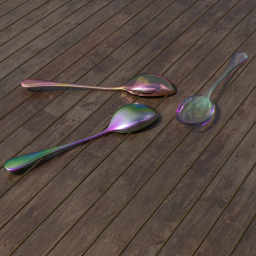
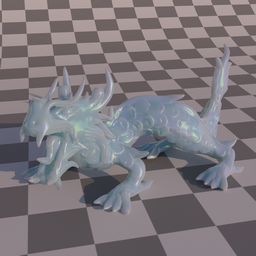

# etx-tracer

Physically-based ray-tracer.

## Features
 * Vertex Connection and Merging algorithm
 * Volumetric Bidirectional Path Tracing integrator (based on PBRT v3)
 * Full-spectral rendering (by sampling single wavelength per ray)
    - spectral representation of material's properties (colors, index of refractions, etc)
    - switching between spectral and RGB rendering in runtime
 * Medium rendering, including subsurface scattering:
    - random walk subsurface scattering
    - Christensen-Burley approximation
    - subsurface scattering could be applied to any material containing diffuse layer (diffuse, plastic, velvet)
 * Variety of BSDFs:
    - basic materials - diffuse, plastic, conductor, dielectric, mirror
    - additional materials - thinfilm, coating, mirror, velvet
 * Variety of emitters:
    - area (including collimated area lights - lasers)
    - environment map
    - directional emitter with finite angluar size
    - atmospheric scattering (generating directional Sun emitter and environment sky emitter)
 * Thin-film rendering over all materials (including conductors)
 * Normal mapping

## Examples
Several renderings from the ray-tracer. Samples contains showcase for materials, volumetric data rendering, spectral rendering, participating media rendering, subsurface scattering and SDS (specular-diffuse-specular paths), which are usually tricky thing to render. As well as thin film rendering, collimated emitters, depth of field, and other effects.

More renderings could be found in my [Twitter](https://twitter.com/serhii_rieznik):

## Platforms
Windows and macOS

#### Story behind this project

This project is a fusion of several my previous projects 
  * [et-engine](https://github.com/sergeyreznik/et-engine) - the old game engine, which actually was used in several shipped games;
  * [etx](https://github.com/sergeyreznik/et-x-classic) - an extension to the engine, which is used for UI;
  * [metal-ray-tracer](https://github.com/sergeyreznik/metal-ray-tracer) - ray-tracer based on Metal Performance Shaders.

#### Project milestones:
Order is a subject to change, but here are main things to do:
- [x] boilerplate code for window, input handling, etc;
- [x] basic boilerplate code for ray-tracing;
- [x] simplest CPU path-tracer;
- [x] OptiX and GPU-related code basics;
- [x] additional code for ray-tracing;
- [ ] GPU path tracing;
- [x] VCM integrators (CPU and GPU);
- [x] Subsurface scattering;
- [x] cross-platform, cross-API support;
  ... maintaining code, adding new features.

## Building
This part of the description would be updated during the development of the project, at the moment there is nothing to build here.
All updates will be located here: [BUILDING.md](docs/BUILDING.md)

## Sponsors
This project is GitHub-sponsored by:
* [Traverse-Research](https://github.com/Traverse-Research)

## Links
Links to the books/papers/publications/resources I've used during the development:
 - [PBRT book](https://www.pbr-book.org/)
 - [VCM paper / implementation](https://cgg.mff.cuni.cz/~jaroslav/papers/2012-vcm/)
 - [Rendering resources by Benedikt Bitterli](https://benedikt-bitterli.me/resources/)
 - [Multiple-Scattering Microfacet BSDFs with the Smith Model](https://eheitzresearch.wordpress.com/240-2/)
